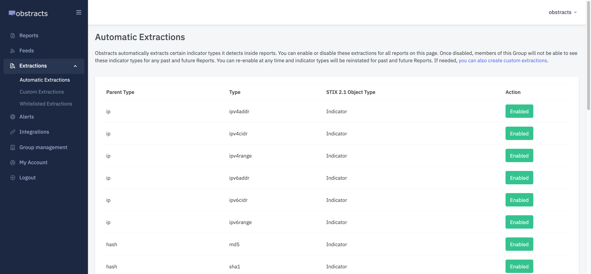
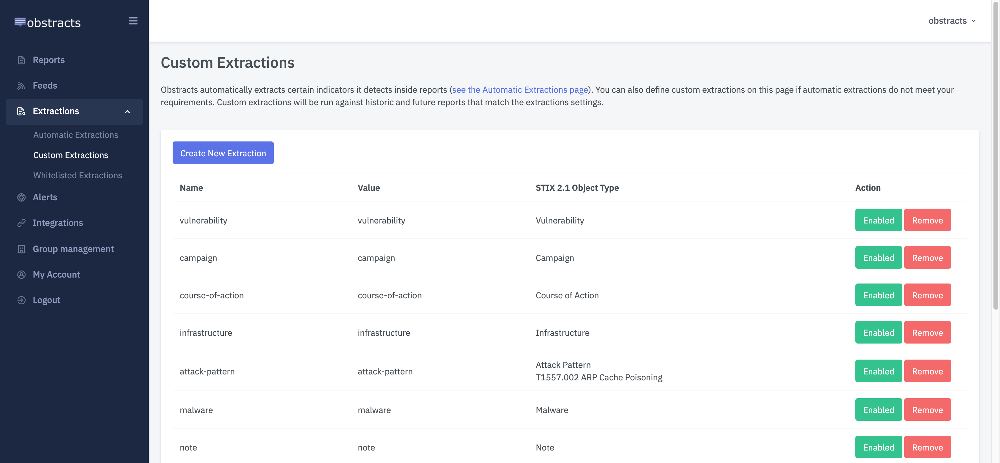
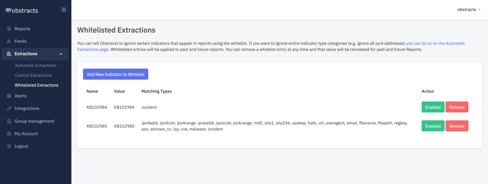
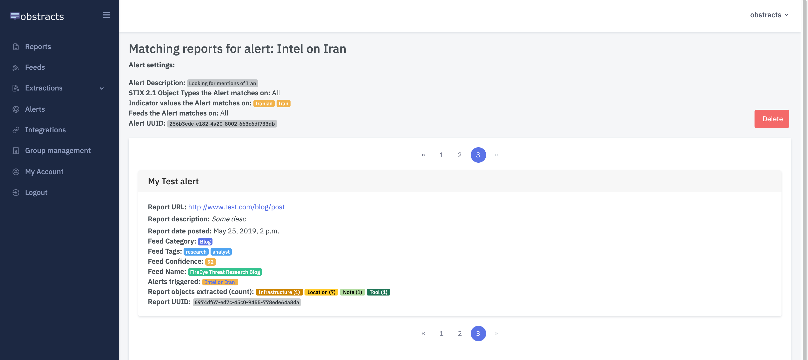
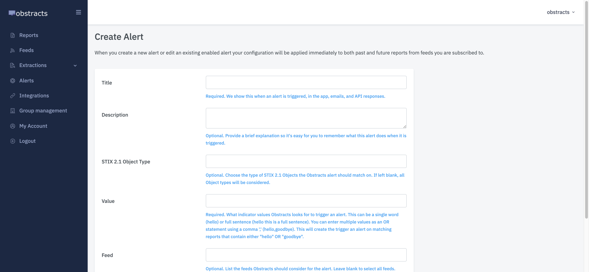
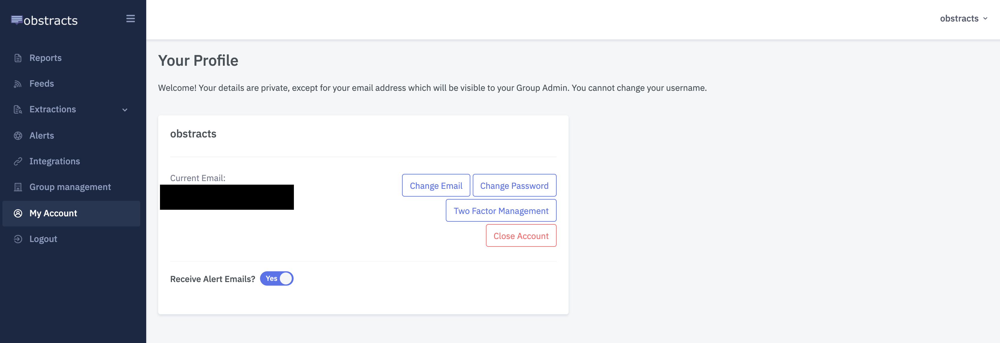

# Threat Intel Management

## Extractions

### Automatic extractions

Obstracts automatically extracts certain indicator types it detects inside reports. You can enable or disable these extractions for all reports.

Once disabled, members of this Group will not be able to see these indicator types for any past and future Reports.

You can re-enable at any time and indicator types will be reinstated for past and future Reports. If needed, you can also create custom extractions.

Go here to manage automatic extractions: [https://app.obstracts.com/indicator/](https://app.obstracts.com/indicator/)

### Custom Extractions

Obstracts automatically extracts certain indicators it detects inside reports \(see Automatic Extractions page\).

You can also define custom extractions if automatic extractions do not meet your requirements.

Custom extractions will only be run against reports uploaded after you create the extraction.

If you need to run the extraction against an existing report, please download the report and re-upload it for extraction.

#### **Custom extraction settings**

* **Name \(**_**required**_**\):** The value Obstracts will use for the object. Usually something like 1.1.1.1 or domain.com.
* **Value \(**_**required**_**\):** What Obstracts looks for in reports to create an indicator match. This is an exact match but is case-insensitive. The value entered here should usually be the same as Name value entered above.
* **STIX 2.1 Object Type \(**_**required**_**\):** Obstracts will create an STIX 2.1 Object type of the type selected. For Attack Pattern objects, you can also attach a MITRE ATT&CK classification.

Go here to manage custom extractions: [https://app.obstracts.com/indicator/custom/](https://app.obstracts.com/indicator/custom/)

### Whitelisted Extractions

You can tell Obstracts to ignore certain indicators that appear in reports using the whitelist.

If you want to ignore entire indicator type categories \(e.g. ignore all ipv4 addresses\) you can do so using Automatic Extractions.

Whitelisted entries will be applied to past and future reports. You can remove an entry at any time and that value will be reinstated for past and future Reports.

#### **Whitelisted extraction settings**

* **Name \(**_**required**_**\):** The value Obstracts will show on whitelist page. Only used to help you identify this whitelist entry.
* **Type \(**_**required**_**\):** The indicator type Obstracts will use to whitelist. You can read more about Indicator Types on the Automatic Extractions page. Leave blank to select all indicator types.
* **Value \(**_**required**_**\):** What Obstracts looks for in reports to whitelist. This can be a single word \(hello\) or full sentence \(hello this is a full sentence\). You can enter multiple values as an OR statement \(hello,goodbye\). This will whitelist matching indicators that contain either "hello" OR "goodbye".

Go here to manage custom extractions: [https://app.obstracts.com/indicator/white\_list/](https://app.obstracts.com/indicator/white_list/)

## Alerts

Alerts are triggered based on indicators. All members of a Group are automatically subscribed to an alert. Alerts are managed at group level.

#### Alert configuration

Obstracts can search for indicators to create an alert.

When a report is uploaded to your group, indicators will be extracted and compared against active alerts.

Obstracts will also search historic indicator extractions for alert matches.

If an indicator matches a configured alert, the alert is triggered. When an alert is triggered you will receive an email and it will show listed on the individual alert page. You can also query triggered alerts using the API \(only available if enabled for your plan\).

#### **Alert settings**

* **Title \(**_**required**_**\):** Shown when an alert is triggered \(in the app, emails, and API responses\).
* Description \(_optional_\): A brief explanation so it's easy for you to remember what this alert does when it is triggered.
* **STIX 2.1 Object Type \(**_**required**_**\):** The type of STIX 2.1 Objects the Obstracts alert should match on. If left blank, all Object types will be considered.
* **Value \(**_**required**_**\):** What Obstracts looks for in reports to trigger an alert. This can be a single word \(hello\) or full sentence \(hello this is a full sentence\). You can enter multiple values as an OR statement using a comma ',' \(hello,goodbye\). This will create the trigger an alert on matching reports that contain either "hello" OR "goodbye".
* **Collection \(**_**required**_**\):** List the collections Obstracts should consider for the alert. Leave blank to select all collections.

Go here to manage alerts: [https://app.obstracts.com/alert/list/](https://app.obstracts.com/alert/list/)

#### Alert email settings

If you do not want to receive enabled email alerts for your group, you can disable them under "My Profile".

